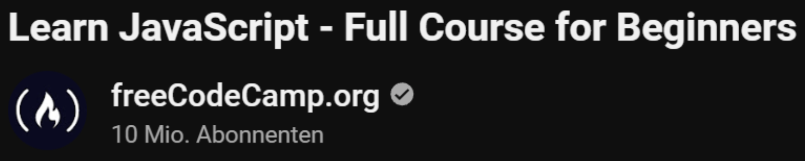
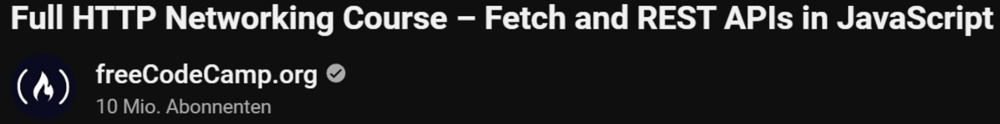
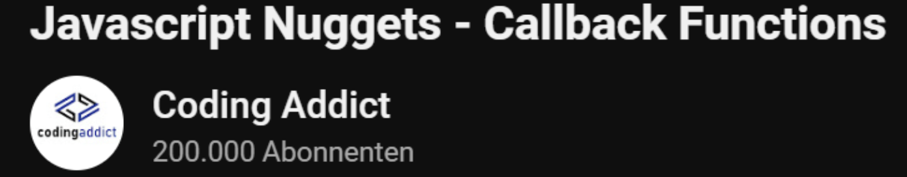
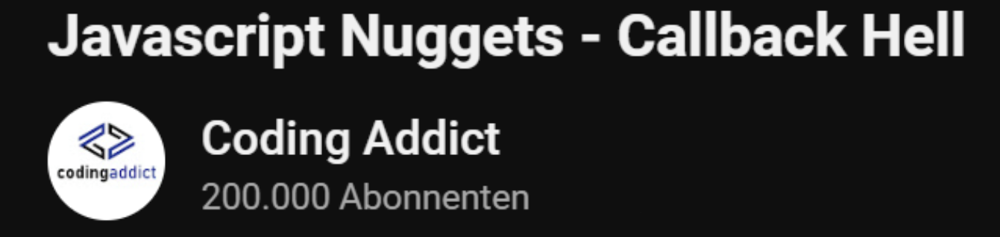
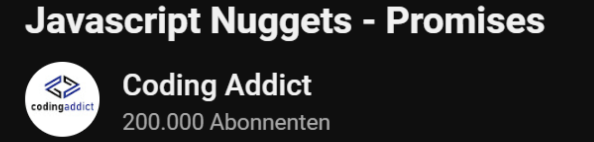
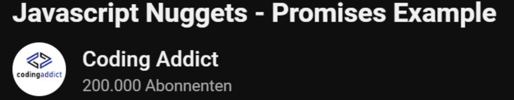
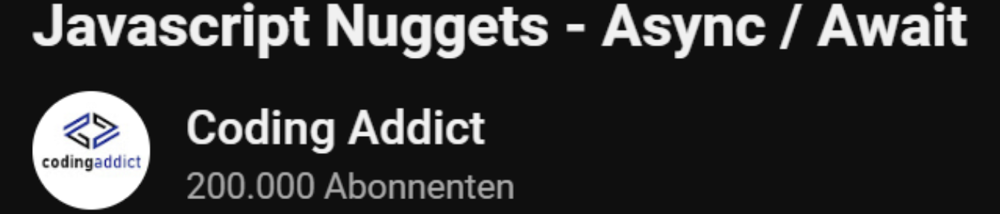
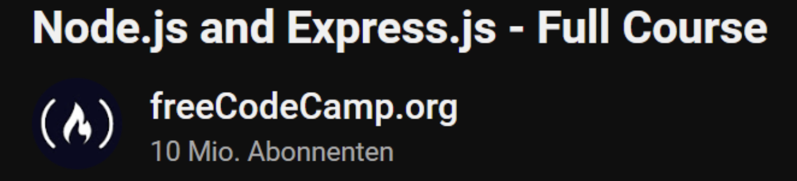

###### 
 WMC-Learning-Path 

 
##### 
 Document your progress by creating summaries and programming the examples.  

##### 
 Push this documentation to your GitHub repo to verify the work you've completed. 
  

## *Documentation of my learning Path:* 
- [Node.js Übung](https://github.com/IxI-Enki/WMCUebung-003)
- [StackBlitz Übung](https://github.com/IxI-Enki/WMCUebung-001)  
- [My personal testing playground for further examples - REST API](https://github.com/IxI-Enki/WmcUebung-004)
- [Promises](https://github.com/IxI-Enki/WmcUebung-005)
- [URI, http- & json-server](https://github.com/IxI-Enki/WmcUebung-006)
- [DNS & ICANN](https://github.com/IxI-Enki/WmcUebung-007)
---

  
 click for Teststoff 

*Zusammenfassung des Teststoffs:*

- *Lernmaterialien:*  
  - Inhalte aus dem 5-stündigen Video sind prüfungsrelevant.  
  - Materialien auf Moodle sind ebenfalls prüfungsrelevant.

### *Themen für die Prüfung:*

#### *1. Asynchroner Code (Promises):*
  - Verständnis und Anwendung von asynchronem Code.  
  - Promises: Beispiele, Pseudocode schreiben und verstehen.  ✅  

#### *2. Multiple-Choice-Fragen:*  
  - *HTTP und HTTPS:* Methoden und Grundlagen.  
  - *JSON:* Was ist JSON, wie verwendet man es? Umgang mit JSON-Dateien (Vergleich mit XML).  
  - *DNS:* Grundlagen, Funktionsweise.  ✅  
  - *Fehlercodes:* Kategorien von Server- und Client-Fehlern (z. B. 404, 505, 303, 202).  ✅  

#### *3. Offene Fragen:*  
  - Unterschiede und Erklärung von synchronem und asynchronem Code.  
  - URL-Aufbau: Parameter, Struktur, Bestandteile.  ✅
  - Verständnis von HTTP-Methoden und deren Einsatz.  

#### *4. REST API (100% wichtig):*
  - Funktionalität von REST APIs erklären:  ✅  
    - Aufbau eines Requests und einer Response. ✅  
    - Daten parsen und weiterverarbeiten.  ✅  
  - Verständnis, wie REST APIs arbeiten und was sie ermöglichen.  ✅  

*Hinweis:* Alle Inhalte des Test haben gesamt eine Gewichtung von insgesamt 100 Punkten.
 

---

 
### *Projektarbeit im nächsten Semester:*   
Nach der Prüfung folgt eine Projektarbeit. 

--- 

- ### 1.) JavaScript
  > Finish either the JavaScript Course on Codecademy or the one from freeCodeCamp

  <!----------------------------------------------------------------------------------------------------------------|----------------------|-----------|------------|-->  
   | Task                                                                                                    | Duration            | Progress | Completed |  
   |--------------------------------------------------------------------------------------------------------:|:--------------------|:--------:|:---------:|  
   | [ Introdcution to JavaScript ](https://www.codecademy.com/learn/introduction-to-javascript)               |                     |          |          |  
   |          | 15h      |  100 %   |  yes ✅  |  
   | [ Learn JavaScript  - Full Course for Beginners](https://www.youtube.com/watch?v=PkZNo7MFNFg) |                     |          |          |  
   |                                          | 3h 27min |  100 %   |  yes ✅  |  
  <!--                                                                                                              | 18h 27min |           |           |-->  
  <!----------------------------------------------------------------------------------------------------------------|----------------------|-----------|-----------|-->  

---
- ### 2.) HTTP Networking
  > Work through the following topics ⚠️

  <!--------------------------------------------------------------------------------------------------------------|----------------------|-----------|------------|-->  
   | Task                                                                                                  | Duration            | Progress | Completed |  
   |------------------------------------------------------------------------------------------------------:|:--------------------|:--------:|:---------:|  
   | [Article: What is HTTP](https://www.freecodecamp.org/news/what-is-http/)                               |                     |          |           |  
   |   | 1h       |   100 %  |  yes ✅  |  
   | [Fetch and REST APIs in JavaScript](https://www.youtube.com/watch?v=2JYT5f2isg4)                        |                     |          |          |  
   |                                       | 5h 9min  |   100 %  |  yes ✅  |  
  <!--                                                                                                            |  6h 9min  |           |           |-->  
  <!--------------------------------------------------------------------------------------------------------------|----------------------|-----------|-----------|-->  

---
- ### 3. JavaScript techniques for web development 
  > Watch the following videos about basic ⚠️

  <!-------|--------------------------------------------------------------------------------------------------------------------|-----------|-----------|------------|-->  
   | Link | Task                                                                                                        | Duration  | Progress | Completed |  
   |-----:|:-----------------------------------------------------------------------------------------------------------:|:----------|:--------:|:---------:|  
   | [ Callback Functions](https://www.youtube.com/watch?v=GWq0XETTOTk&list=PLnHJACx3NwAfRUcuKaYhZ6T5NRIpzgNGJ&index=13) |                | 13min  |   0%  |    ❌   |  
   | [ Callback Hell](https://www.youtube.com/watch?v=bx9xYPt2tdc&list=PLnHJACx3NwAfRUcuKaYhZ6T5NRIpzgNGJ&index=14)      |        |  7min  |   0%  |    ❌   |  
   | [ Promises](https://www.youtube.com/watch?v=IBjmTlShf6U&list=PLnHJACx3NwAfRUcuKaYhZ6T5NRIpzgNGJ&index=15)           |                |  13min |  100% | yes ✅  |  
   | [ Promises Example](https://www.youtube.com/watch?v=GKVA6jYrgKc&list=PLnHJACx3NwAfRUcuKaYhZ6T5NRIpzgNGJ&index=16)   |  | 13min  |  100% | yes ✅  |  
   | [ Async / Await](https://www.youtube.com/watch?v=iHrVo5fvmzE&list=PLnHJACx3NwAfRUcuKaYhZ6T5NRIpzgNGJ&index=17)      |               | 17min  |   0%  |    ❌   |  
  <!--                                                                                                          Gesamtaufwand:  |   63min     |          |           |  
  <!--|-------------------------------------------------------------------------------------------------------------------------|-------------|-----------|----------|-----------|-->  

---
- ### 4.) Node.js & Express
  >  Work through the following video 

  <!----------------------------------------------------------------------------------------------------------------------------|------------|-----------|-----------|-->  
   | Link | Task                                                                                                        | Duration  | Progress | Completed |  
   |-----:|:-----------------------------------------------------------------------------------------------------------:|:----------|:--------:|:---------:|  
   | [Node.js and Express.js - Full Course](https://www.youtube.com/watch?app=desktop&v=Oe421EPjeBE) |  | 8h 17min |   100 %  |   yes ✅  |  
  <!----------------------------------------------------------------------------------------------------------------------------|------------|-----------|------------|-->  
  
---
- #### Optional Additional Sources
  - [Learn JavaScript DOM Manipulation – Tutorial for Beginners](https://www.youtube.com/watch?v=IWRS_AM2fiE)
